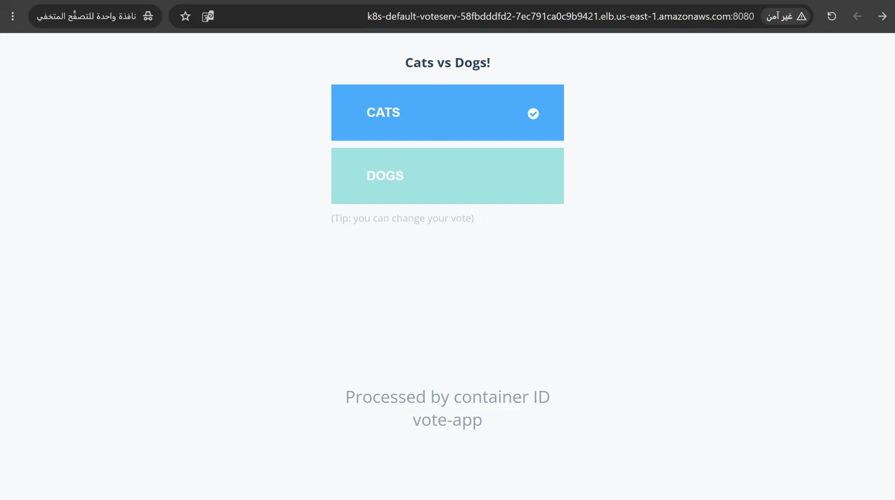
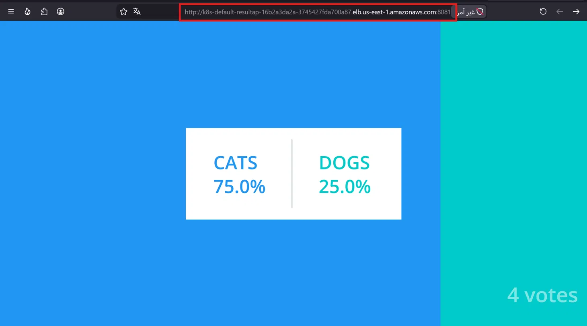
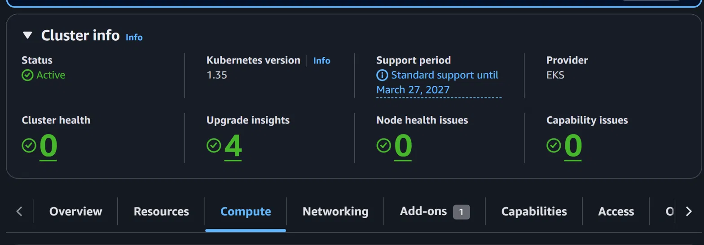
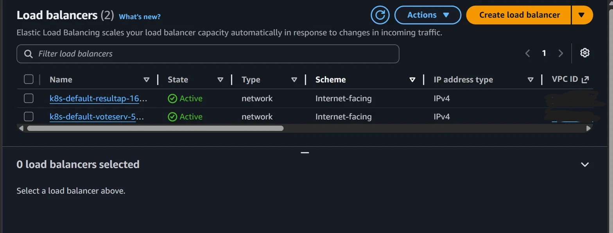

# 🗳️ Multi-Tier Voting App on AWS EKS

A multi-tier microservices application deployed on **Amazon EKS** using Kubernetes Pods and Services. Users can vote between Cats vs Dogs, with results updated in real-time.


---

## 🏗️ Architecture

```
User
 │
 ├──→ Vote App (Python) ──→ Redis ──→ Worker (.NET) ──→ PostgreSQL
 │         │                                                  │
 └──→ Result App (Node.js) ←───────────────────────────────────┘

LoadBalancer (vote-service)   →  Vote Frontend  (port 8080)
LoadBalancer (result-app)     →  Result Frontend (port 8081)
ClusterIP    (redis)          →  Redis           (port 6379)
ClusterIP    (db)             →  PostgreSQL       (port 5432)
```

---

## 🧩 Components

| Component | Image | Type | Service |
|-----------|-------|------|---------|
| Vote App | `kodekloud/examplevotingapp_vote:v1` | Pod | LoadBalancer |
| Result App | `kodekloud/examplevotingapp_result:v1` | Pod | LoadBalancer |
| Worker | `kodekloud/examplevotingapp_worker:v1` | Deployment | — |
| Redis | `redis` | Pod | ClusterIP |
| PostgreSQL | `postgres` | Pod | ClusterIP |

---

## 📁 Project Structure

```
k8s-voting-app-eks/
├── vote-app.yaml           # Vote frontend Pod
├── vote-service.yaml       # Vote LoadBalancer Service
├── Result-App.yaml         # Result frontend Pod
├── result-server.yaml      # Result LoadBalancer Service
├── worker-deployment.yaml  # Worker Deployment
├── redis.yaml              # Redis Pod
├── redis-service.yaml      # Redis ClusterIP Service
├── post.yaml               # PostgreSQL Pod
└── postgresql-service.yaml # PostgreSQL ClusterIP Service
```

---

## 🚀 Deployment

### Prerequisites
- AWS EKS Cluster (Kubernetes v1.35+)
- `kubectl` configured with EKS cluster
- AWS Load Balancer Controller installed
- VPC subnets tagged with `kubernetes.io/role/elb=1`

### Deploy All Resources

```bash
kubectl apply -f .
```

### Verify Deployment

```bash
kubectl get pods
kubectl get svc
```

Expected output:
```
NAME         READY   STATUS    RESTARTS   AGE
db           1/1     Running   0          1m
redis-app    1/1     Running   0          1m
result-app   1/1     Running   0          1m
vote-app     1/1     Running   0          1m
worker-...   1/1     Running   0          1m
```

### Access the App

```bash
# Get Load Balancer URLs
kubectl get svc vote-service result-app
```

Open in browser:
- **Vote App**: `http://<vote-service-EXTERNAL-IP>:8080`
- **Result App**: `http://<result-app-EXTERNAL-IP>:8081`

---

## 🐛 Issues I Debugged

### 1. PostgreSQL Pod Crashing (CrashLoopBackOff)
**Problem:** The `postgres` image requires a mandatory environment variable.

**Fix:** Added `POSTGRES_PASSWORD` env variable to the Pod spec:
```yaml
env:
  - name: POSTGRES_PASSWORD
    value: "postgres"
```

### 2. Worker Can't Connect to Database
**Problem:** The Worker app looks for a hostname called `db` — but the Service was named `postgresql-service`.

**Fix:** Renamed the PostgreSQL Service to `db` to match what the Worker expects:
```yaml
metadata:
  name: db  # must match the app's expected hostname
```

### 3. LoadBalancer Stuck on `<pending>`
**Problem:** AWS Load Balancer Controller couldn't find subnets with the required tags.

**Fix:** Tagged the VPC subnets with:
```
kubernetes.io/role/elb = 1
kubernetes.io/role/internal-elb = 1
```

---

## 📸 Screenshots

| Vote App | Result App |
|----------|------------|
|  |  |

| EKS Cluster | Load Balancers |
|-------------|----------------|
|  |  |

---

## 📌 Key Learnings

- Kubernetes **Service naming** matters — apps connect to other services by their Service name as a DNS hostname
- PostgreSQL Docker image requires `POSTGRES_PASSWORD` env variable to start
- AWS EKS LoadBalancer provisioning requires proper **subnet tags** on the VPC
- `kubectl describe svc <name>` is essential for debugging pending LoadBalancers

---

> Part of my Kubernetes learning journey — working toward **CKA** certification 🎯
